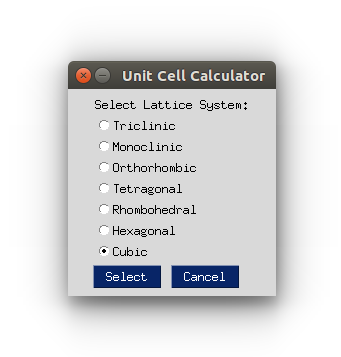
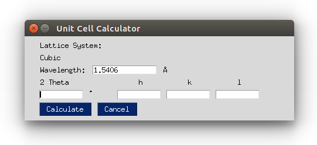
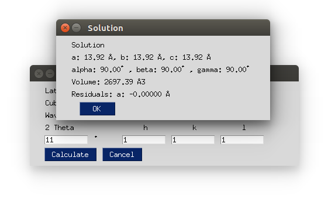

# Unit call calculator

Calculate lattice parameters from X-ray diffraction data.

### Input: 
Lattice system, peaks positions (2 Theta) and peaks h k l indices.

### Output:
Lattice parameters: a, b , c, alpha, beta, gamma, unit cell volume.

## User interface

Select Lattice system

Input parameters

Results

